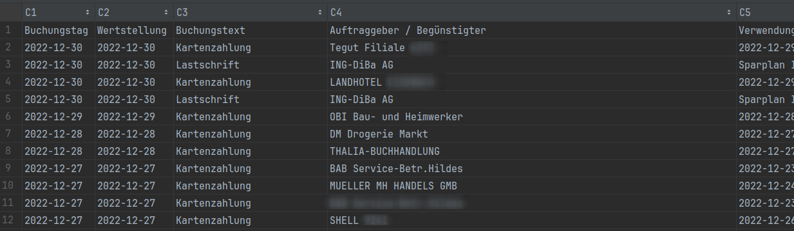
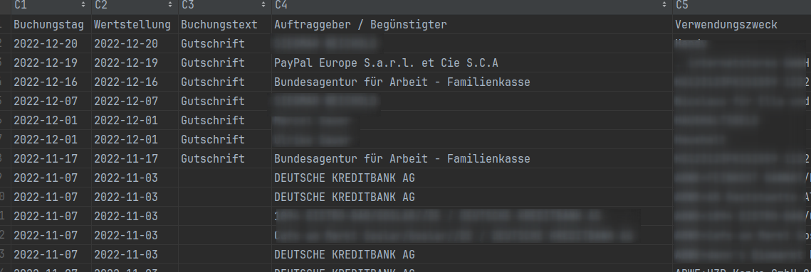
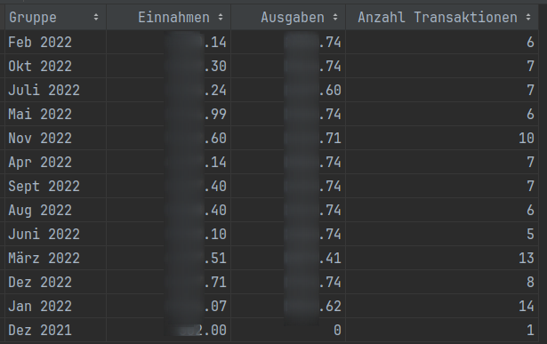
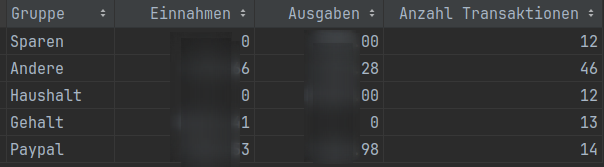
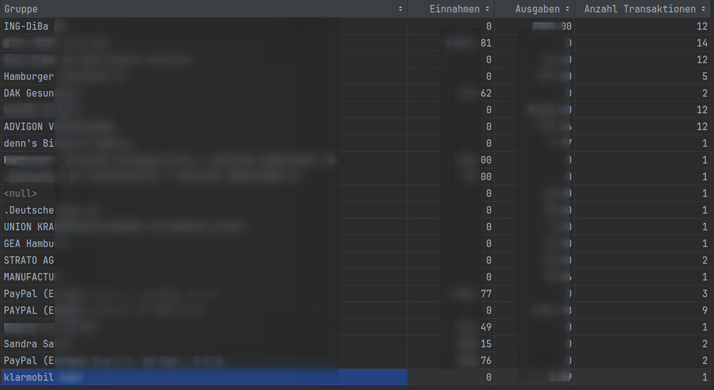
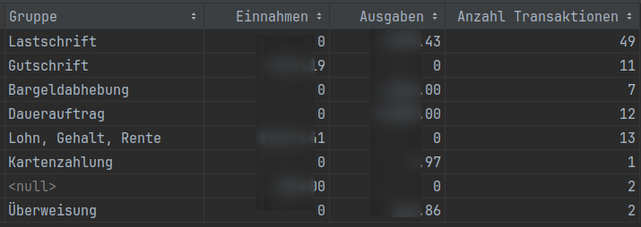
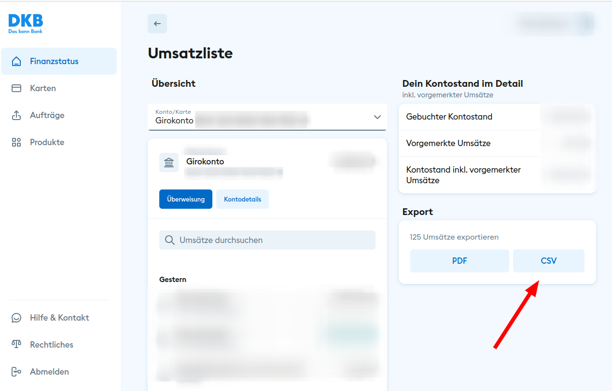

# Deutsche Kreditbank (DKB) Account Summary 

This project is a simple tool to generate csv files (statistics) from your DKB account statements (=input csv).

It will produce the following output files:

| file                                         | content                                                                         | example                                     |
|----------------------------------------------|:--------------------------------------------------------------------------------|---------------------------------------------|
| money_spent.csv                              | money you spent (all lines from the input where money left your account)        |              |  
| money_received.csv                           | money you received (all lines from the input where your account received money) |           |  
| grouped_by_month_year.csv                    | money you received and spent by month                                           |    |  
| grouped_by_regex.csv                         | money you received and spent grouped by regular expression                      |         |  
| grouped_by_auftraggeber_or_beguenstigter.csv | money you received and spent grouped by Auftraggeber or Beguenstigter           |    |
| grouped_by_buchungstext.csv                  | money you received and spent grouped by Buchungstext                            |  |


# How to use

1. Download IntelliJ IDEA Community Edition or Eclipse or any IDE of your choice supporting importing maven projects
2. Import/Open this project
3. Download your DKB statements in csv format (see below where to find this) into a folder on your harddisk (this will be your ```DKB_INPUT_CSV``` file later)
4. Copy the [sample config](src/test/resources/test.config) to the same folder and rename it to ```config.properties``` (this will be your ```CONFIG_FILE``` later)
5. Create a folder on your harddisk where you want to store the generated csv files (this will be your ```OUTPUT_FOLDER``` later)
6. Open [Dkb.java](src/main/java/de/marcelsauer/bank/Dkb.java) and change the ```DKB_INPUT_CSV``` ```CONFIG_FILE``` and ```OUTPUT_FOLDER``` to your values 
7. Run ```Dkb.java``` and check the generated csv files in the ```OUTPUT_FOLDER```
8. Open generated csv files in your tools of choice (e.g. excel, libreoffice, openoffice, numbers) and generate charts. make sure to use the correct delimiter (";") when importing the csv files.

## DKB CSV File Download




## Example charts


